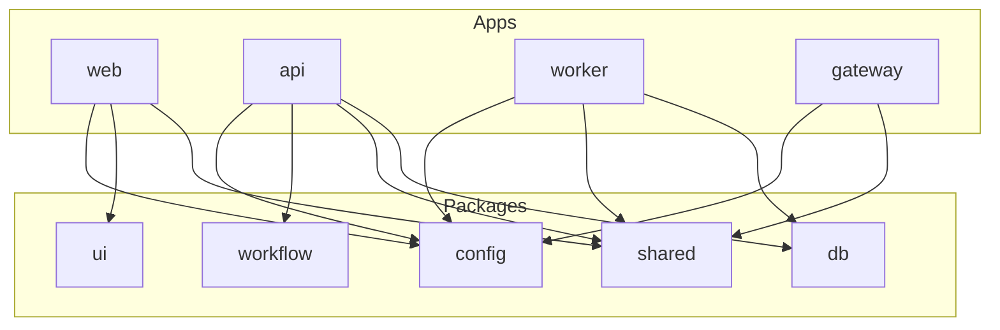

# Deal Coordinator

Multi-tenant AI transaction coordinator for real estate brokerages. Teams capture deal context from chat and structured workflows, route exceptions, and keep an auditable history of what changed and why—without giving up workspace isolation.

## Tech stack

| Layer | Choices |
| --- | --- |
| Monorepo | [pnpm](https://pnpm.io/) workspaces, [Turborepo](https://turbo.build/) |
| Web | [Next.js](https://nextjs.org/) 14 (App Router), React 18, Tailwind |
| API | [NestJS](https://nestjs.com/) 10, Prisma, Zod validation |
| Data | PostgreSQL 16, Prisma ORM |
| Cache / queue (future) | Redis (Compose locally; worker is a stub in Phase 1) |
| Gateway | Node HTTP server forwarding chat webhooks to the API |
| Shared logic | TypeScript packages: `shared`, `workflow`, `ui`, `config`, `db` |

## Monorepo layout

```
deal-coordinator/
├── apps/
│   ├── web/        # Next.js brokerage UI
│   ├── api/        # NestJS REST API
│   ├── worker/     # Background jobs (Phase 1: placeholder loop)
│   └── gateway/    # Chat webhook ingress → API
├── packages/
│   ├── db/         # Prisma schema, client, migrations, seed
│   ├── shared/     # Types, Zod schemas, constants, errors
│   ├── ui/         # Shared React components
│   ├── workflow/   # Deal stage state machines & transition guards
│   └── config/     # Typed env loading
├── docs/           # Architecture, environments, phase notes, ADRs
└── scripts/        # setup.sh, dev helpers
```



## Prerequisites

- **Node.js** 22 or newer (see root `engines` in `package.json`)
- **pnpm** 9 (repo pins `packageManager` in `package.json`; use [Corepack](https://nodejs.org/api/corepack.html) or install pnpm globally)
- **Docker** and Docker Compose (for local Postgres and Redis)

## Quick start

1. **Clone** the repository and open the root directory.

2. **Environment** — copy the example env file:

   ```bash
   cp .env.example .env
   ```

   Adjust values if your local ports or credentials differ.

3. **Infrastructure** — start Postgres and Redis:

   ```bash
   docker compose up -d
   ```

4. **Dependencies**:

   ```bash
   pnpm install
   ```

5. **Database** — generate the Prisma client, apply migrations, and seed demo data:

   ```bash
   pnpm db:generate
   pnpm db:migrate
   pnpm db:seed
   ```

   Alternatively, run the full scripted setup (Compose, install, `.env`, generate, migrate, seed):

   ```bash
   pnpm setup
   ```

6. **Development** — run all apps via Turborepo:

   ```bash
   pnpm dev
   ```

   Typical local URLs: web `http://localhost:3000`, API `http://localhost:3001`, worker logs only, gateway `http://localhost:3003`.

## Scripts

| Script | Description |
| --- | --- |
| `pnpm dev` | Start dev servers for all packages that define `dev` |
| `pnpm build` | Production builds (Turbo, dependency-aware) |
| `pnpm lint` | ESLint across the workspace |
| `pnpm typecheck` | TypeScript `--noEmit` checks |
| `pnpm test` | Unit tests (e.g. Vitest in `shared`, `workflow`, `api`) |
| `pnpm format` | Prettier write |
| `pnpm format:check` | Prettier check (CI-friendly) |
| `pnpm db:generate` | `prisma generate` for `@deal-coordinator/db` |
| `pnpm db:migrate` | `prisma migrate dev` (interactive local migrations) |
| `pnpm db:seed` | Seed demo workspace, users, and deals |
| `pnpm db:studio` | Open Prisma Studio |
| `pnpm setup` | `scripts/setup.sh`: Docker, install, env, generate, migrate, seed |

Per-package scripts are defined in each `package.json`; Turbo orchestrates them from the root.

## Environment configuration

- **Local**: Use `.env` at the repo root (see `.env.example`). `APP_ENV=local` is typical.
- **Secrets**: Never commit real API keys or production database URLs. Use your host’s secret store in staging/production.
- **AI**: Phase 1 defaults to `AI_PROVIDER=fake` so parsing works without external APIs.

A fuller variable reference and per-environment notes live in [docs/environments.md](docs/environments.md).

## Architecture

High-level system design, tenancy model, API conventions, workflow engine, chat ingestion path, and AI/audit policies are documented in [docs/architecture.md](docs/architecture.md).

## Phase 1 scope (summary)

Phase 1 delivers an end-to-end **vertical slice**: multi-tenant API with header-based workspace context, deal CRUD and stage transitions backed by an in-repo state machine, chat ingest (gateway → API) with a **fake** AI parser, unresolved items and exceptions, communications and memory surfaces, dashboard metrics, and append-only audit events. Auth is stubbed via `x-user-id` / `x-workspace-id` headers; the worker and Redis-backed jobs are placeholders.

See [docs/phase1.md](docs/phase1.md) for deliverables, deferred work, limitations, and Phase 2 themes.

## CI/CD

- **CI** (`.github/workflows/ci.yml`): on pushes and PRs to `main`, installs with pnpm, runs Prisma generate, lint, typecheck, test, and build against PostgreSQL 16.
- **Staging backend** ([`render.yaml`](render.yaml)): Render **Blueprint** (Postgres + API + gateway + worker on **`main`**). Services use **`autoDeployTrigger: commit`** so Render deploys on each push to `main` (set to **`checksPass`** in `render.yaml` if you want deploys only after GitHub CI succeeds). See [docs/environments.md](docs/environments.md) for deploy hooks and Vercel setup.
- **Deploy Staging** (`.github/workflows/deploy-staging.yml`): runs after **CI** completes successfully on a **push to `main`** (and on manual `workflow_dispatch`). Optionally POSTs Render **deploy hooks** if `RENDER_DEPLOY_HOOK_*` secrets are set; optionally runs **`vercel deploy --prod`** if `VERCEL_TOKEN`, `VERCEL_ORG_ID`, and `VERCEL_PROJECT_ID` are set on the **`staging`** GitHub environment (otherwise use Vercel’s Git integration for `apps/web`).
- **Web:** deploy `apps/web` on **Vercel** with root directory `apps/web` and [`apps/web/vercel.json`](apps/web/vercel.json); set `NEXT_PUBLIC_API_URL` to the hosted API URL. First-time steps: [docs/vercel-first-setup.md](docs/vercel-first-setup.md) and [`scripts/vercel-link-web.sh`](scripts/vercel-link-web.sh).
- **Production** (`.github/workflows/deploy-production.yml`): still a placeholder; mirror the Render blueprint in a second workspace or promote images when you are ready.

Configure GitHub Environments (`staging`, `production`) with required reviewers and secrets as you harden production.

## Contributing

1. Branch from `main`, keep changes focused, and match existing formatting (Prettier, ESLint).
2. Run `pnpm lint`, `pnpm typecheck`, and `pnpm test` before opening a PR.
3. For behavioral or structural decisions, add or update an ADR under `docs/adr/` (see existing numbered records).
4. Database changes go through Prisma migrations in `packages/db/prisma/migrations`; avoid editing applied migration history.

Architectural decisions are recorded as [Architecture Decision Records](docs/adr/) in `docs/adr/`.
